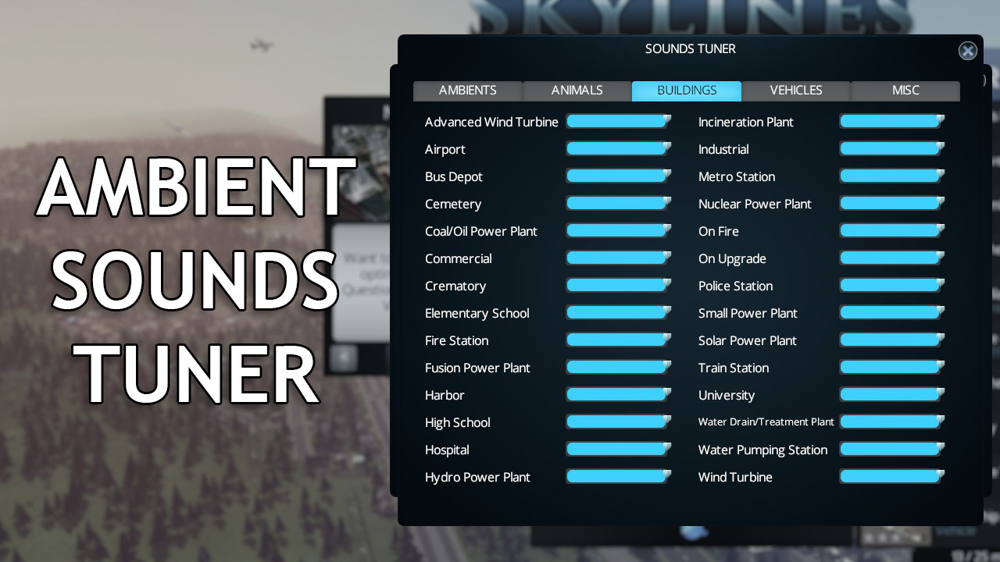

# Cities Skylines: Ambient Sounds Tuner

Sick of hearing those wind sounds when zoomed out, or those seagulls screaming
at you, but you still want to hear other ambient sounds? This mod will allow you
to tune each different ambient sound type individually.

After installing this mod, there will be a new category in the game settings.
Within this category, you can change the volume and various sounds:
- Various ambient sounds, like Agricultural, City, Industrial, Sea, and more
- Animal sounds, like cows, pigs and seagulls
- Various sounds from buildings, like Commercial, Industrial, various power
  plants, various stations, buildings that are on fire, and more
- Various vehicle sounds, like small and large cars, metros, trains, various
  sirens, and more
- Various miscellaneous sounds, like bulldozer sounds, UI clicking sounds, and
  more

**Note:** In order to enable custom sounds, you have to create or install custom
sound packs. More information about creating sound packs can be found
[on the wiki](https://github.com/Archomeda/csl-ambient-sounds-tuner/wiki/Creating%20Sound%20Packs).
Have you created a custom sound pack and you want to have it included here on
GitHub and the Steam Workshop? Let me know!

## Installation
Go to the
[Steam Workshop](http://steamcommunity.com/sharedfiles/filedetails/?id=455958878)
and subscribe to the mod, it will install automatically. This will also keep it
updated with newer releases. If you want to do it manually, you can clone this
repo, compile the code yourself and place the DLLs in your mods folder.
Alternatively, download an artifact from
[AppVeyor](https://ci.appveyor.com/project/Archomeda/csl-ambient-sounds-tuner/branch/master).

## Compatibility
This mod is based on version 1.2.0-f3 of Cities Skylines, and it is not
guaranteed that it will work on later versions. I'll try to keep it updated when
newer versions are released however.

If a newer version of Cities Skylines breaks your game, don't worry. This mod
should not break your saves (as far as I know). Just disable the mod for the
time being until an update of this mod is released.

### Mods
This mod should be compatible with all mods, as long as they don't change the
following stuff:
- The values of `AudioManager.instance.m_properties.m_ambients`
- The values of `m_audioInfo` within an `EffectInfo` that is a `SoundEffect`
- Detouring of `UIComponent.PlayClickSound()` and
  `UIComponent.PlayDisabledClickSound()`

The following mods are **known to be incompatible**:
- *SilenceObnoxiousSirens*  
  This mod basically sets the volume of every siren to 0 in the same location as
  Ambient Sounds Tuner does. However, Ambient Sounds Tuner allows you to
  customize the volume of each siren. Therefore, SilenceObnoxiousSirens is not
  needed when using Ambient Sounds Tuner and has to be disabled or removed.

If you happen to have one or more of these mods installed and enabled, you will
be warned in the debug log (F7). Please do not report issues with these mods as
they are incompatible.

The following mods are **possibly incompatible**:
- *[ARIS] Remove Cows*  
  Note that this mod overwrites the sounds of the cows. This means that while
  this mod is active, Ambient Sounds Tuner might not able to change the sound
  and/or volume of cows.
- *[ARIS] Remove Pigs*  
  Note that this mod overwrites the sounds of the pigs. This means that while
  this mod is active, Ambient Sounds Tuner might not able to change the sound
  and/or volume of pigs.
- *[ARIS] Remove Seagulls*  
  Note that this mod overwrites the sounds of the seagulls. This means that
  while this mod is active, Ambient Sounds Tuner might not able to change the
  sound and/or volume of seagulls.

## Contributing
I'm open for any contributions you can make. If you find a bug, create an issue
here on GitHub. GitHub is very nice with maintaining a list of issues.
Submitting a bug report on the Steam Workshop is also appreciated, but it might
take a little longer for me to respond, because I prefer GitHub. If you know C#,
you can try to fix it yourself and submit a pull request.

### Compilation Notes
Note that setting up your development environment is a bit different from the
Cities Skylines wiki. As you might have noticed, there aren't any hardcoded
references to the assemblies of Cities Skylines. Instead, these dependencies are
currently maintained by me on a NuGet server. This means that upon building, the
dependencies should be resolved automatically. If, for some reason, this doesn't
work, please check if the feed `https://www.myget.org/F/cities-skylines/api/v2`
has been added and that NuGet automatically restores packages upon building.

When a newer version of Cities Skylines is released, it's possible that the
NuGet feed or `packages.config` gets outdated. If there's no apparent work in
progress to update either of those, don't hesitate to create an issue to make me
aware of it.
